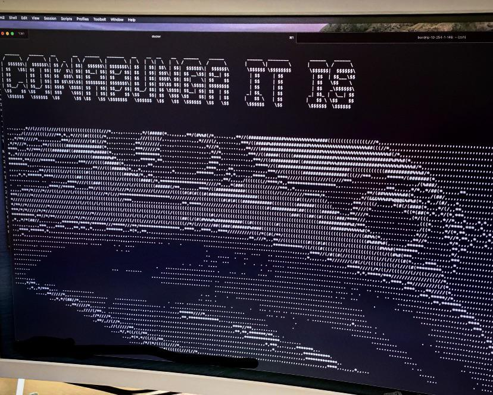

# COWABUNGA IT ISSS

A joke repo for displaying the "cowabunga it is" meme on the terminal before running unit tests



## How to run

Step 1: Clone the repo

```bash
git clone git@github.com:imbatman4/cowabunga_it_is.git
cd cowabunga_it_is
```
Step 2: Set an alias to your bash profile

```bash
vim ~/.bash_profile
alias ut="cat output.txt && <command_to_run_your_unit_test_here>"
```

Step 3: ???

Step 4: Profit.

ref: https://www.slanglang.net/cowabunga-it-is/